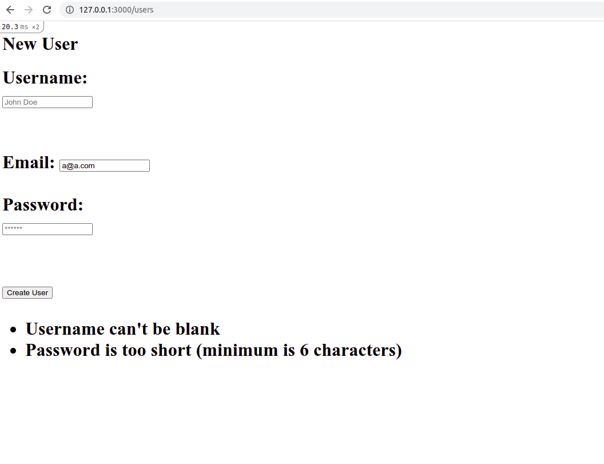

# Bare Metal Forms and Helpers

> This is part of the Forms Project in The Odin Project’s Ruby on Rails Curriculum, which is also part of Microvese's Technical Curriculum. To make it, we followed [these tutorial instructions](https://www.theodinproject.com/paths/full-stack-ruby-on-rails/courses/ruby-on-rails/lessons/forms).

This project helped us to actually built some forms, both using nearly-pure HTML and then graduating to using the helper methods that Rails provides.

## Built With

- Ruby 3.0.0
- Rails 6.1.3.2 (Ruby Gem)
- Sqlite 1.4.2 (Ruby Gem)

## Getting Started

To get a local copy up and running, please follow these steps:

### Prerequisites

For this project, the following environment should be previously installed on your machine:

- Ruby 3.0.0
- Rails 6.1.3.2
- Node 14.17.0
- Yarn 1.22.10

### Setup

- Go to your terminal bash and, on any directory of your preference, run `git clone git@github.com:angelacuahutle/re-former.git`
- Next, run `cd re-former` to go into the project root directory
- Run `bundle exec rake webpacker:install` to install all Ruby Gems this project requires
- Run `rails generate controller` in order to generate UsersController 

### Install

- Run `rails db:migrate` to migrate the databases needed to run this project
- Run `rails console` to perform your own tests with your newly created database and their validations, as well! You'll be able to **C**reate, **R**ead, **U**pdate and **D**estroy any records from your tables: authors, posts, and comments. Here you have a simple summary with the most relevant features of each Table and their associations:

  #### Authors

      - username:string [unique, 4-12 chars, present]
      - email:string [unique, present]
      - password:string [6-16 chars, present]
      - id:integer
      - created_at:datetime
      - updated_at:datetime

      - *has_many posts*
      - *has_many comments*

  #### Model

User
  - username:string [present, unique]
  - email:string [present, unique]
  - password:string [present, length 6..20]

## Authors

👤 **Angela Natalia Cuahutle**

- GitHub: [@angelacuahutle](https://github.com/angelacuahutle/)
- Twitter: [@AngelaCunaDev](https://twitter.com/AngelaCunaDev)
- LinkedIn: [https://www.linkedin.com/in/angela-cuahutle-75228bab/](https://www.linkedin.com/in/angela-cuahutle-75228bab/)

👤 **Ênio Neves de Souza**

- GitHub: [@enionsouza](https://github.com/enionsouza)
- Twitter: [@enionsouza](https://twitter.com/enionsouza)
- LinkedIn: [https://www.linkedin.com/in/enio-neves-de-souza/](https://www.linkedin.com/in/enio-neves-de-souza/)

## 🤝 Contributing

Contributions, issues, and feature requests are welcome!

Feel free to check the [issues page](https://github.com/angelacuahutle/micro-reddit/issues).

## Show your support

Give a ⭐️ if you like this project!

## Acknowledgments

- [Microverse](https://www.microverse.org/)
- [The Odin Project](https://www.theodinproject.com/)
- [Rails Guides](https://guides.rubyonrails.org/index.html)

## 📝 License

This project is [MIT](./LICENSE) licensed.
