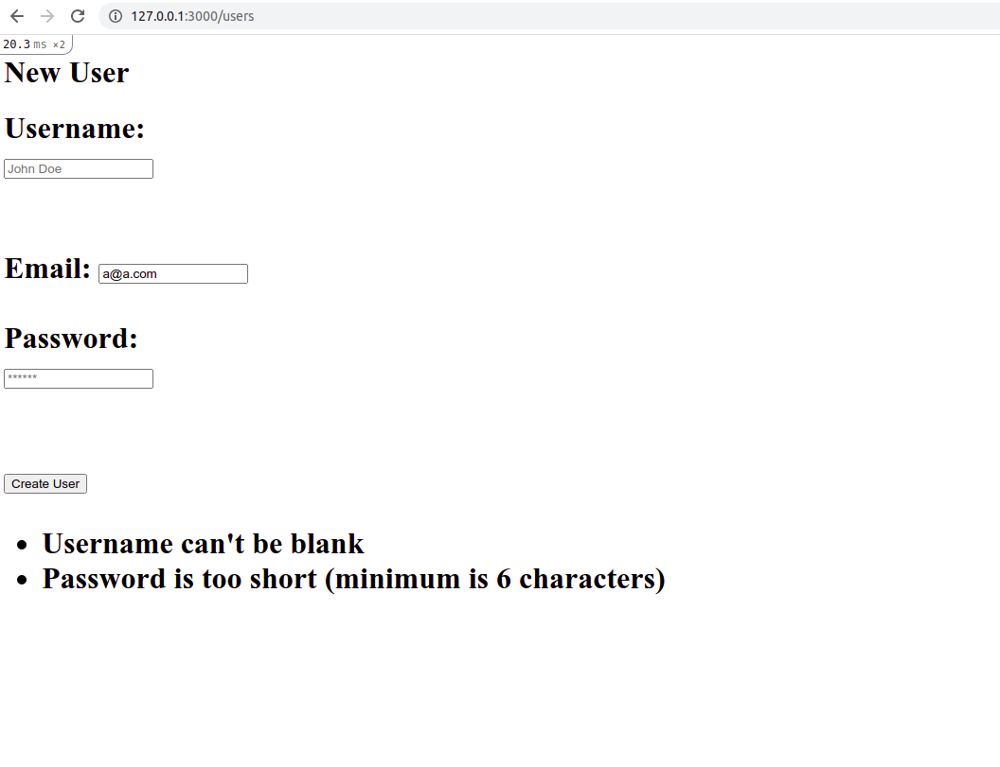

# Bare Metal Forms and Helpers

> This is part of the Forms Project of The Odin Project’s Ruby on Rails Curriculum, which is also part of Microvese's Technical Curriculum. To make it, we followed [these tutorial instructions](https://www.theodinproject.com/paths/full-stack-ruby-on-rails/courses/ruby-on-rails/lessons/forms).



This project helped us to actually build some forms, first using nearly-pure HTML and then we went through, gradually, using the helper methods that Rails provides. Note that this project doesn't intent to provide any styles to the created views.

## Built With

- Ruby 3.0.0
- Rails 6.1.3.2 (Ruby Gem)
- Sqlite 1.4.2 (Ruby Gem)

## Getting Started

To get a local copy up and running, please follow these steps:

### Prerequisites

For this project, the following environment should be previously installed on your machine:

- Ruby 3.0.0
- Rails 6.1.3.2
- Node 14.17.0
- Yarn 1.22.10

### Setup

- Go to your terminal bash and, on any directory of your preference, run

```sh
$ git clone git@github.com:enionsouza/re-former.git
```

- Next, run `$ cd re-former` to go into the project root directory.
- Run `$ bundle install` to install all Ruby Gems this project requires.
- And, finally, to prevent any issue that might eventually come up because of webpacker package, run

```sh
$ bundle exec rake webpacker:install
```

### Install

- Run `$ rails db:migrate` to migrate the databases needed to run this project.
- Run `$ rails server` to start your local host. You can stop your local server pressing `<ctrl> + c` on your keyboard.
- On the browser of your preference, you can go to http://127.0.0.1:3000/users/new and fill out the form to create your own records (users). Please, note that the validations presented below sould be taken into account.
- To update (edit) any of your users, please visit [http://127.0.0.1:3000/users/**ID**/edit](http://127.0.0.1:3000/users/1/edit). _IMPORTANT: Please, note that you should change the **ID** in this url to the number of the id of the user you want to edit_.

      User (table schema)

      - username:string [present, unique]
      - email:string [present, unique]
      - password:string [present, length 6..20]

## Authors

👤 **Angela Natalia Cuahutle**

- GitHub: [@angelacuahutle](https://github.com/angelacuahutle/)
- Twitter: [@AngelaCunaDev](https://twitter.com/AngelaCunaDev)
- LinkedIn: [https://www.linkedin.com/in/angela-cuahutle-75228bab/](https://www.linkedin.com/in/angela-cuahutle-75228bab/)

👤 **Ênio Neves de Souza**

- GitHub: [@enionsouza](https://github.com/enionsouza)
- Twitter: [@enionsouza](https://twitter.com/enionsouza)
- LinkedIn: [https://www.linkedin.com/in/enio-neves-de-souza/](https://www.linkedin.com/in/enio-neves-de-souza/)

## 🤝 Contributing

Contributions, issues, and feature requests are welcome!

Feel free to check the [issues page](https://github.com/enionsouza/re-former/issues).

## Show your support

Give a ⭐️ if you like this project!

## Acknowledgments

- [Microverse](https://www.microverse.org/)
- [The Odin Project](https://www.theodinproject.com/)
- [Rails Guides](https://guides.rubyonrails.org/index.html)

## 📝 License

This project is [MIT](./LICENSE) licensed.
